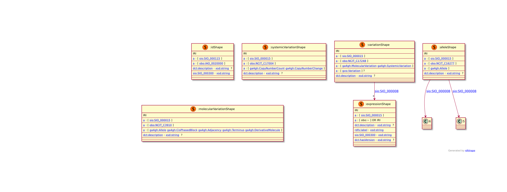

# Introduction
There is currently no standardized representation of genomic variants in RDF. The Variation Representation Specification (VRS) is a GA4GH-approved standard intended to support exchange of genomic variation data between computational systems [@citesAsAuthority:Wagner2021]. VRS provides a terminology and information model that in combination with the decision design of using variants represented as VRS objects (and inheritance) enables users to focus on semantic precision and describe from simple to complex variations in a flexible way. Currently, VRS machine-readable schema is written in YAML (see the schema on [GitHub](https://github.com/ga4gh/vrs/blob/2.x/schema/vrs/vrs-source.yaml)) and implemented in JSON Schema (see the JSON implementation on [GitHub](https://github.com/ga4gh/vrs/tree/2.x/schema/vrs/json)). However, the VRS schema cannot be readily translated to semantic web frameworks since it lacks of this support. Furthermore, there is a lack of recommended ontologies that can be used for more precise semantics and interoperability with the bioinformatics community. To address this issue we modelled an VRS RDF Schema to enable interoperability of using this standard within the semantic web community.

# Results
## Implementation
We implemented an RDF Schema in ShEx, using OWL ontologies in the [OBO Foundry](https://obofoundry.org/) such as the [NCI Thesaurus (NCIT)](https://obofoundry.org/ontology/ncit.html), the [Semanticscience Integrated Ontology (SIO)](https://github.com/MaastrichtU-IDS/semanticscience), and the [Genome Variation Ontology (GVO)](http://genome-variation.org/resource/gvo). We based our modelling on the [VRS Schema expressed in YAML](https://github.com/ga4gh/vrs/tree/2.x/schema/vrs) accessed during the BioHackathon 2024 week, i.e., 25-31 August and in the design principles currently used to update the GA4GH Phenopackets standard in RDF [@citation:Kaliyaperumal_2022]

## GA4GH VRS RDF schema
GA4GH VRS RDF schema on [GitHub](https://github.com/NuriaQueralt/ga4gh-vrs-rdf-schema.git)

{width=50%}

## Compliance
We aligned our RDF work to the schema in the [YAML document](https://github.com/ga4gh/vrs/tree/2.x/schema/vrs) following the guide in the *Machine Readable Specifications* section of the [documentation](https://vrs.ga4gh.org/en/stable/schema.html#machine-readable-specifications). The degree of alignment achieved was 30\% (6 out of 21 objects) with the VRS specification and we followed a top-down approach such as the VRS abstraction itself, where everything rolls up to Variation. In particular, we aligned the following VRS objects: Ga4ghIdentifiableObject, Variation, Expression, MolecularVariation, SystemicVariation and Allele. We used the ShEx inheritance feature to express the VRS object oriented design.

# Discussion
We modelled the GA4GH VRS standard into RDF to standardise genomic variation description. The importance of aligning with VRS is for interoperability with semantic web technologies, frameworks and linked data networks such as the [https://rdfportal.org/](https://rdfportal.org/), the European Joint Programme Rare Diseases Virtual Platform or the SPHN federated health data network, and with tools such as VRSAnnotator ([https://github.com/ohsu-comp-bio/vrs-annotator/tree/main](https://github.com/ohsu-comp-bio/vrs-annotator/tree/main)) for further VCF annotation.

## Future work
To finish the RDF modelling for all the objects of the VRS specification. To demonstrate the model with a use case.

We welcome feedback and contributions from the community. Please, use the issue and pull requests system at https://github.com/NuriaQueralt/ga4gh-vrs-rdf-schema

## Acknowledgements
We thank the DBCLS BioHackathon 2024 organizers for hosting the event and providing support. 

## References
